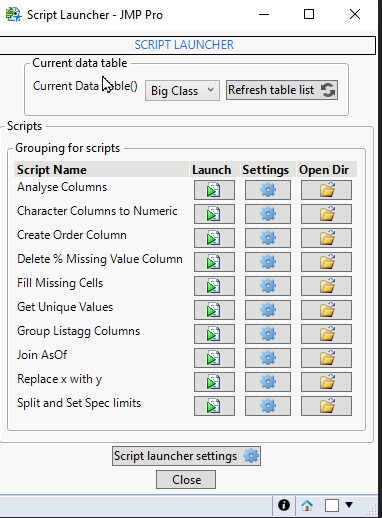
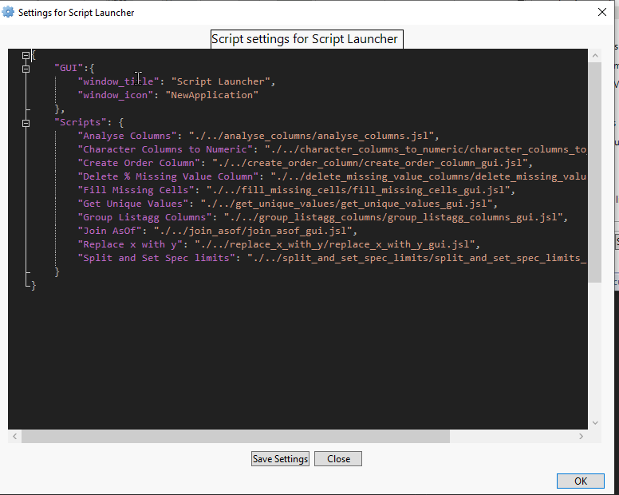
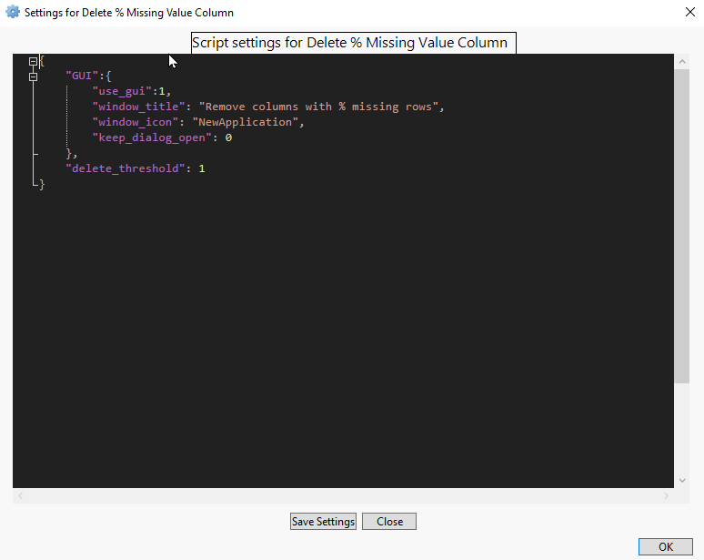
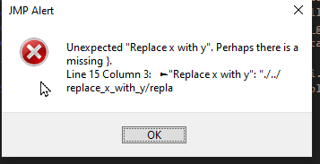

# Script Launcher

Tool to provide quick-access to user selected scripts. Provides also access to launching scripts, modifying their settings.json file and opening the directory. Also allows changing current datatable.

Strongy suggested to add as shortcut with easy access, for example mine is Ctrl+Shift+Z. If the script is already open, launching it again will bring it to front.

## Startup

## Launcher Settings

## Script Settings

## Incorrect Settings Format Error 
